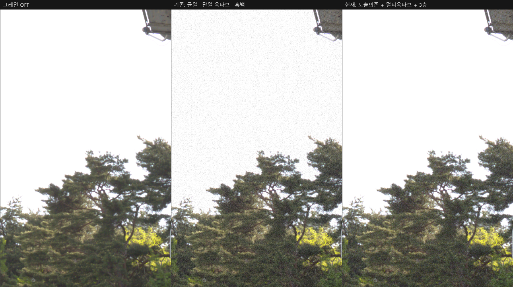
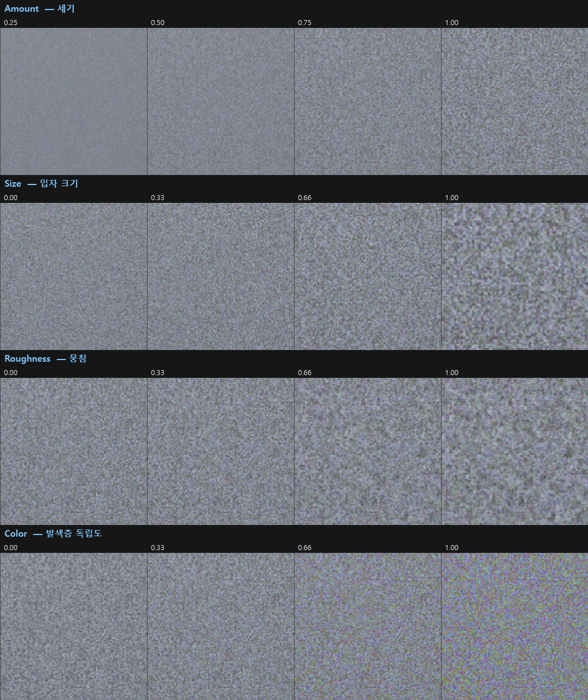
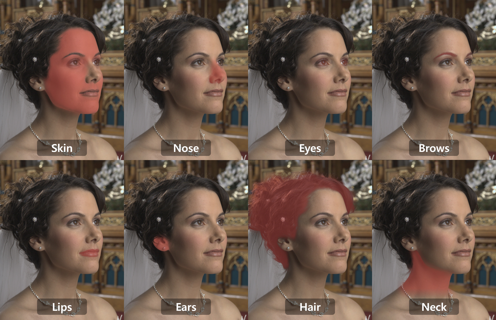
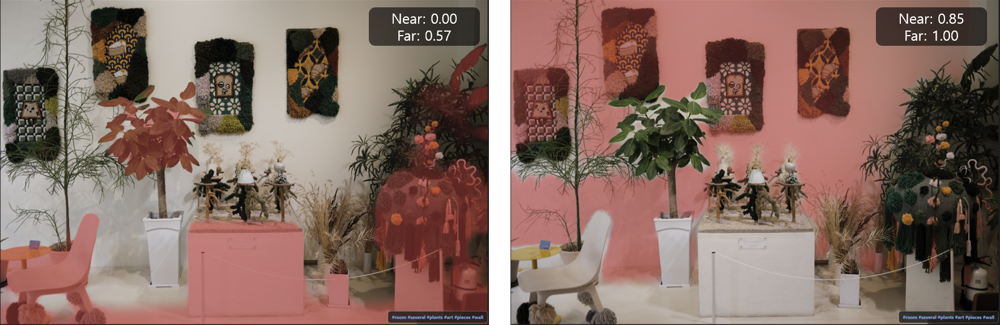

# Features

The full feature reference. For the short version, see the [README](../README.md).

> **Every shortcut is listed in the app** — press `?` (or `F1`) for the full
> keyboard and mouse reference, including the gestures that are easy to miss
> (double-click a slider to reset it, double-click the photo to zoom 1:1).

## Develop
- **Scene-linear + filmic** tone pipeline — physically-grounded base render with a single highlight-rolloff tone curve (no per-scene heuristics)
- **White balance** — absolute Kelvin + tint via the Planckian locus, with as-shot estimation for off-locus illuminants
- **Light** — exposure (scene-linear stops), contrast, highlights / shadows / whites / blacks (Lightroom-style local tone zones)
- **Tone curve** — Catmull-Rom editor with **per-channel RGB** curves (master + R/G/B) for color grading
- **HSL color mixer** — 8 hue bands × hue / saturation / luminance
- **Color** — vibrance & saturation
- **Detail** — texture, clarity, dehaze, and **sharpening** (amount / radius / detail / masking)
- **Noise reduction** — edge-preserving luminance NR (guided filter) + color NR, with an optional **AI denoise** base (NAFNet, auto-downloaded ~117 MB; GPU-accelerated via DirectML when available, with a confirm prompt before falling back to the much slower CPU path)
- **Effects** — **film grain** (emulsion model — see below) and vignette
- **Highlight reconstruction** — hue-aware desaturation that neutralizes clipped-highlight color casts (e.g. a fire core) while preserving saturated colored light sources (neon, signs)

### Film grain

Grain is modelled on what film emulsion actually does, not sprinkled on as noise:

- **Tone-dependent amplitude** — visible tone fluctuation is grain density × the slope of the
  characteristic curve, so grain peaks in the midtones and disappears from blown highlights and
  crushed blacks. Uniform-amplitude grain speckling a white sky is the main thing that reads as
  "digital"; the middle panel below is the previous behaviour, the right one is this model, both at
  the same maximum Grain setting (σ 6.6 against 12.2/255 on that crop). This curve is
  **fitted to real film** — 11,512 flat patches from 151 frames across four rolls of Noritsu-scanned
  negative, the fitted constant agreeing to within 5.5% between rolls.
- **Multi-octave** — real emulsion has a crystal size distribution and clumping, so its Wiener
  spectrum is broad rather than single-scale (`Roughness`).
- **Three dye layers** — colour film has no separate luminance grain: the R/G/B layers develop
  independently and the luminance fluctuation is their *sum*, which is why colour film speckles in
  colour (`Colour`). The layers are **not identical**: the blue-sensitive layer needs a fast emulsion,
  which means large silver-halide crystals and therefore the coarsest dye clouds, while the
  red-sensitive layer is the finest — so the colour speckle lands mostly on the blue–yellow axis, and
  coarse, which is exactly where the eye is least able to resolve it. Set `Colour` to 0 to drop chroma.

`Roughness` and `Colour` change the **texture only** — the grain's strength is normalised so it
stays put as you dial them, and both are saved per photo. ⚠️ Judge grain at 1:1 zoom; fit-to-screen
averages it away.

  

Four controls — Amount, Size, Roughness and **Colour** — where Lightroom's Effects panel exposes
three and has no colour-grain axis. More to the point, the tone behaviour is automatic and fitted
to measurement: at the same settings, amplitude runs ×0.20 in a blown highlight, ×0.99 in the
midtones and ×0.85 in shadow, while skewness runs −0.92 (dark specks) to +0.51 (bright specks).
Even the blown highlight keeps a fifth of the midtone amplitude, because measured film does.

  

This reproduces those statistical behaviours but is **not a physical simulation** — the noise
primitive is lattice value-noise rather than a stochastic model of discrete silver-halide crystals,
and it is applied after the tone curve rather than as a density fluctuation before it. The model,
the measurements, and the full list of what is *not* physical are in
[`film_grain.md`](film_grain.md).

## Mist filter

A diffusion (mist) filter modelled as scattering, not as a blur. Part of the light is scattered into
a halo while the rest passes straight through, so fine detail stays sharp and highlights bloom around
it — the way real mist filters behave in front of the lens:

- **Amount** — how much of the light scatters.
- **Character** — white mist (a halo hugging the highlights) through black mist (a lifted, milky
  veil across the shadows). Both come from the same kernel, redistributed.
- **Radius** — how far the scatter reaches.
- **Highlight** — how much of the energy the sensor clipped away is restored into the halo. `0` is
  pure physics (energy-conserving); without it a bright scene gives a grey film rather than a glow.
- **Colour** — keeps the scattered light's brightness but pulls its colour back toward the scene,
  for when a cold light source washes out the warm surfaces around it.

The scatter is computed in camera-native scene-linear, ahead of white balance, the colour matrix and
exposure — those are per-pixel linear operations that commute with the blur exactly, so the result is
unchanged while the scattering field becomes independent of all three and can be cached per photo.
⚠️ Unlike the grain model, this one is **not fitted to measurement** — the kernel shape uses the
1/θ² tail from the glare-scattering literature as a prior. Model, numbers and the route to measuring
it: [`mist_filter.md`](mist_filter.md) (Korean).

## Masking (local adjustments)
- **AI selection, three families** — a **Scene** tab (SegFormer-B2 / ADE20K), a **Face** tab, and a **Depth** tab; models auto-download on first use
  - **Scene** — tick any combination of **Sky / Vegetation / Building / Ground / Water / Mountain / Person**
  - **Face** — pixel-precise face parts: **Skin / Nose / Eyes / Brows / Glasses / Lips / Mouth / Ears / Hair / Hat / Neck**
  - **Depth** — select by **distance** instead of by what a thing is: a Near/Far range with adjustable feather, from a monocular depth estimate (Depth Anything V3 Small). This is the axis semantic segmentation can't reach — *the front leaves of the same bush*, *everything behind the subject*, *only the far end of a receding wall*. Ticking it on **seeds the range from that photo's own distance histogram** and starts on the background, because a fixed default can't work: the distance distribution differs from shot to shot even after normalization. The red overlay stays on while you drag so you can see the range land. Distance is **relative per photo**, so the same Near/Far falls differently on another shot — pasted edits may need a nudge.
- **Pick which face** — the Face tab shows a thumbnail of every detected face (up to the 5 largest); click one to include or exclude it. Defaults to the largest face alone, so someone walking past in the background never gets your subject's skin correction. The choice is per layer, so one layer can brighten person A while another warms person B.
- **Manual brush** — paint the mask by hand on top of whatever the AI selected: **A** adds, **S**
  subtracts, **Esc** puts the brush away, and **O** toggles the red overlay so you can see what you
  are painting. Strokes belong to the active layer and each one is a single undo step (`Ctrl+Z`), so
  a stray drag costs one keypress, not the whole mask.
- **Composite** — the mask is the union of everything ticked across both tabs, recomposed live from cached inference (switching parts is instant; no re-inference)
- **Up to 5 layers** — create and delete mask layers, each with its own mask *and* its own adjustments (e.g. sky brighter, skin warmer, mountains darker in one photo)
- **Edge-refined soft mask** — guided-filter refinement against image luminance for clean branch/hairline boundaries, plus invert and a red mask overlay
- **Per-mask develop** — Exposure / Temp / Tint / Contrast / Highlights / Shadows / Texture / Clarity / Dehaze / Saturation, applied only to the masked region in both preview and export
- Masks persist per-image (regenerated from the saved classes on reopen)

### Face masking

Face masking is two models working together: **YuNet** locates faces (232 KB), then **SegFormer-B5
trained on CelebAMask-HQ** parses each face crop into 19 classes. The detector only decides where to
crop — boundary precision comes from parsing plus the guided filter, so masks follow the real hairline
and jaw rather than a box. Opening the Face tab runs detection alone (~60 ms) so the thumbnails appear
before the 340 MB parser is ever fetched; only the faces you actually select are parsed (~0.8 s each),
and part toggles after that are ~10 ms.

  

### Depth masking

Depth masking runs at ~0.75 s per photo (GPU via DirectML; ~1.2 s on CPU), and after that dragging
the Near/Far range updates continuously at ~100 ms because only the band-pass is recomputed — the
depth map itself is estimated once and cached per image. See
[`depth_masking.md`](depth_masking.md).

  

## AI Caption
- **On-device English captions** — Microsoft **Florence-2** running locally via ONNX (MIT-licensed model); no cloud, no account
- Captions generate automatically when a photo finishes loading and appear in a bar under the preview (toggle with `C`)
- Three detail levels — **Short / Detailed / Paragraph** — switch via the combo; each level is generated once and cached in the folder sidecar (`.filmrawsterycaptions.json`)
- The ~1.1 GB model never downloads silently: the bar offers a one-time **click-to-download opt-in**, and captions stay automatic afterwards
- ⚠️ Small-model honesty: object/people **counts can be off by one** and long captions may embellish details — treat it as a browsing aid, not ground truth

  

## Folder search & Photo tags
Turns the on-device captions into a way to **browse a whole folder by content**:
- **Caption search** — a search box over the file explorer filters the folder by caption **keywords** (the content words behind the captions — hashtag-style, with stopwords / numbers / very short tokens dropped). Terms are prefix-matched and AND-combined.
- **Background indexing** — one click on **⚙ Index** captions the whole folder in the background (**CPU-only**, so it never contends with the GPU preview/edit and can't crash it), **resumable** (already-captioned photos are skipped), with a live coverage bar. Browsing and editing stay responsive throughout, and progress stays tied to the folder it started on if you navigate away.
- **Photo tags** (`H`, or the 🏷 button) — an immersive, frosted-glass **tag view** of the folder: each keyword's size scales with how many photos carry it (a single-hue sequential ramp), with a separate **♥ In liked photos** group. Hover a tag to preview its photos in a grid on the right; **click a tag** (or any preview thumbnail) to filter the explorer to it. A header line summarizes the folder — photos · indexed · unique tags · liked.

Captions are stored once as their raw text, so the search and tag rules are derived at query time — changing them needs no re-indexing.

  

## Film Simulations
Fujifilm looks as 3D LUTs: Provia, Velvia, Astia, Classic Chrome, Classic Negative, Nostalgic Neg, PRO Neg. Hi/Std, Eterna, Reala Ace, Bleach Bypass — with adjustable strength. The list is driven by the `.cube` files present in `luts/`, so any known LUT you drop in (e.g. B&W ACROS / Monochrome / Sepia) appears automatically, and missing ones are hidden. See [`../luts/README.md`](../luts/README.md) for the key filenames and where to get the B&W LUTs.

## Film date stamp
Reproduces a film **quartz date-back** — not text pasted on top, but a simulation of the LED imprint that exposed the *same emulsion* as the photo:
- **Additive (screen) blend** — the imprint adds light the way the LED exposes film: it glows over dark areas and washes out over bright highlights, instead of sitting on top like a sticker (mixed with a touch of source-over so highlights don't erase it entirely)
- **Same-emulsion grain** — the stamp carries the photo's film grain (linked to the Grain amount), so it's never cleanly digital
- **Halation** — hot-core → amber → red-orange bloom, the way bright light scatters in the emulsion
- **Segment / dot / text fonts** — DSEG seven-/fourteen-segment (Regular / Bold, upright / italic), a round-dot matrix (Doto), plus typewriter (Courier Prime), terminal (VT323) and condensed (Oswald) — all SIL OFL. **Add your own** `.ttf`/`.otf` from anywhere, including the Windows font folder; the file is copied into your user data folder so the recipe keeps working if the original moves.
- **Colour, glow brightness and glow area** — one colour drives the whole hot-core → halo ramp, so a neutral colour gives a white imprint that suits black-and-white frames. Glow brightness dials the bloom from crisp to heavy; glow area widens it without moving the digits.
- **Frame-relative placement** — imprinted in the sensor's bottom-right corner via EXIF orientation, so portrait shots rotate it into the matching corner
- **Your settings are remembered** — font, size, margin, colour, glow and the on/off state carry over to the next photo that has no saved edits, so a whole roll doesn't need setting up again. Photos you already edited still open exactly as you saved them. Its own panel tab (`Ctrl+4`); toggle the stamp with `D`.
- The date defaults to the EXIF capture date and is editable.
- **Preview vs saved file** — over bright areas, a strongly coloured imprint looks a little stronger on screen than in the saved file. **The saved file is the accurate one**; white or grey looks identical in both. (Why: the imprint is light, and light washes out over highlights — the live preview can't reproduce that exactly. Numbers and the reason it can't be fixed without changing the export: [`date_stamp.md`](date_stamp.md).)

See [`date_stamp.md`](date_stamp.md) for the physical model and implementation.

  

## Geometry
Crop (aspect-ratio presets + free drag), rotate / straighten, flip, and perspective (vertical / horizontal keystone + scale) — applied identically in preview and export.

## Lens Corrections
Distortion, vignetting, and chromatic aberration — applied from the **per-shot correction tables Fujifilm embeds in every RAF** (focus/aperture-aware, works for any body and lens, fixed or interchangeable). No profile database needed; files without the tags are simply left uncorrected.

## Recipe presets

Save the look you built and put it on another photo.

- A badge grid of your recipes, each with a colour, a description and the **origin** it was made from
  (camera and lens, filled in from EXIF and editable).
- Applying a recipe **keeps the photo's own edits** — white balance, crop, geometry and masks are
  untouched, because a recipe carries the look only. **Exposure is deliberately excluded**: it belongs
  to the frame, not to the look.
- The badge lights up when the current photo's look matches that recipe **exactly** — it is a
  function of what you can see, never of hidden history, so two photos that look the same always show
  the same badge.
- Drag rows to reorder; right-click for edit / export / delete. Recipes are plain `.frpreset` JSON
  files, so they can be shared.
- **"Take the look I have now"** updates an existing recipe in place (its origin and version stamp
  update with it, so the banner never claims a look came from a camera it didn't), and each photo
  remembers which recipe it came from.

## Workflow
- **Before / After compare** — toggle the unedited original (button or `\` key)
- **Zone System overlay** (`Z`) — paints the frame by Ansel Adams zone, so you can see where the
  tones actually land instead of guessing from the histogram (preview only; never exported)
- **Undo / redo** — snapshot history of all adjustments (`Ctrl+Z` / `Ctrl+Shift+Z`)
- **Non-destructive, per-image persistence** — edits autosave to a `.filmrawsteryedits/<file>.json` sidecar and restore when you reopen the image
- **File explorer** with RAF thumbnails and a likes/favorites filter
- **Live histogram** reflecting current adjustments
- **Full-resolution export** to JPEG / PNG / TIFF (background-threaded, UI stays responsive)
- **AI Models screen** — the left panel footer shows what has been downloaded; open it to see each model's size and status, pre-download anything missing instead of waiting on first use, and spot files no longer claimed by any feature
