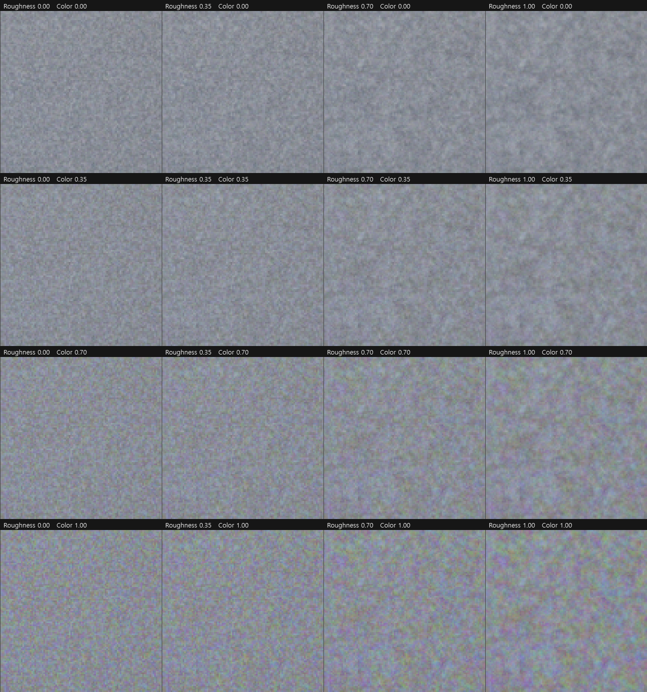

# 필름 그레인 — 에멀전 모델

Film Rawstery 의 그레인은 "노이즈를 얹는" 기능이 아니라, **실제 필름 에멀전이 보이는 통계적
성질을 따라가도록** 만든 모델이다. 세 가지를 모델링한다.

1. **노출 의존 진폭** — 미드톤에서 가장 잘 보이고 날아간 하이라이트/뭉개진 섀도에서는 사라진다
2. **멀티 옥타브** — 결정 크기 분포와 뭉침(clumping) 때문에 넓어진 스펙트럼
3. **3층 에멀전** — 컬러 필름의 R/G/B 발색층이 각자 독립 현상되며 생기는 색 얼룩

> ⚠️ **물리 시뮬레이션은 아니다.** 위 세 가지는 실제 필름의 성질이 맞지만, 이 구현은 그 성질을
> *재현*할 뿐 은염 결정의 현상 과정을 풀지 않는다. 자세한 범위는 [물리적 정직성](#물리적-정직성)
> 절에 정리했다.

관련 파일: `shaders/adjust.frag`(12단계) · `pipeline.py`(`_grain_field`) · `coeffs.py` ·
`ui/Main.qml`(GRAIN 섹션)

---

## 무엇이 달라지는가

<p align="center">
  
</p>

가운데가 이전의 균일 그레인이다. **날아간 하늘에까지 같은 세기로 노이즈가 뿌려져** 지저분해
보인다. 오른쪽이 현재 모델 — 하늘은 깨끗해지고 나뭇잎의 입자감은 그대로다.

---

## 1. 노출 의존 진폭

### 근거

눈에 보이는 톤 요동은 **입자 밀도 요동 × 특성곡선(D-logE)의 기울기**다. 기울기는 직선부
(미드톤)에서 최대고 toe(섀도)/shoulder(하이라이트)에서 0으로 떨어진다. 그래서 실제 필름은
새하얀 영역과 새까만 영역에 그레인이 보이지 않는다. 균일 진폭이 "디지털 노이즈"처럼 읽히는
가장 큰 이유가 이것이다.

### 구현

```glsl
float lg = clamp(dot(rgb, LUMA), 0.0, 1.0);
float w  = mix(1.0, sqrt(4.0*lg*(1.0-lg)), grainToneK);   // 미드톤 1.0, 양 끝 (1-K)
rgb += n * grainAmt * grainK * w;
```

`sqrt` 를 씌워 반원형(가운데 평평, 끝단 급락)으로 만든 것은 특성곡선의 실제 형태에 맞춘 것이다.
`mix()` 의 기준점이 1.0 이라 **미드톤 진폭은 계수와 무관하게 항상 1.0** — 기존 룩이 보존되고
재정규화가 필요 없다.

부수적으로, 이 휘도는 **display 공간** 값이라 벨이 이미 섀도 쪽으로 치우쳐 있다
(disp 0.5 ≈ linear 0.21). 실제 필름에서 그레인이 하이라이트보다 섀도에 더 보이는 것과 맞아
떨어져서, 비대칭 파라미터를 따로 두지 않았다.

<p align="center">
  
</p>

---

## 2. 멀티 옥타브 (fBm)

### 근거

단일 옥타브는 셀 크기가 하나뿐이라 규칙적으로 보인다. 실제 에멀전은 결정 크기 분포와
**결정 뭉침(clumping)** 때문에 Wiener 스펙트럼이 넓고 저주파 에너지가 크다.

### 구현

```glsl
// grainLayer() — 한 발색층의 옥타브 스택 (r = Roughness 슬라이더)
((valueNoise(g)                     - 0.5)
 + (valueNoise(g*0.5  + GRAIN_OFF1) - 0.5) * r
 + (valueNoise(g*0.25 + GRAIN_OFF2) - 0.5) * r*r)
* inversesqrt(1.0 + r*r + r*r*r*r)           // RMS 보존
```

**⚠️ 옥타브는 '거친 쪽'(f/2, f/4)으로만 쌓는다.** 기본 옥타브가 이미 프록시에서 셀 1.71px
(gridN=1500 @ 2560px)이라 f×2 는 Nyquist 미만이 된다. 그러면 프록시와 풀해상도에서 에일리어싱이
다르게 접혀 프리뷰 ≠ Export 가 된다. 거친 쪽으로 쌓는 것은 위의 clumping 근거와도 맞는다.

**⚠️ 옥타브 오프셋은 필수다.** 없으면 세 격자가 원점 정수 셀을 공유해 해시가 같은 값을 내고,
옥타브가 독립이 아니게 되어 아래의 RMS 정규화 전제가 깨진다.

### 시도했다가 되돌린 것: 옥타브 회전

value-noise 의 축정렬 격자 흔적을 없애려고 옥타브마다 좌표를 다른 각도로 회전시켜 봤다.
**측정 결과 기여가 없어서 제거했다.**

| | lag2 방향 이방성 | lag4 이방성 |
|---|---|---|
| 단일 옥타브 | 7.17 | ~10⁶ |
| 멀티옥타브, 회전 없음 | 2.58 | 1.56 |
| 멀티옥타브, 회전 있음 | 2.65 | 1.61 |

등방성 개선은 멀티옥타브 자체가 다 하고 있었다. 회전은 격자를 없애는 게 아니라 **돌려놓을
뿐**이었고, 공유 격자 주기(4셀=6.8px) 보강도 양쪽 다 ~0.01 로 무의미했다. 회전을 뺀 덕분에
좌표가 분리형으로 남아 [성능 최적화](#성능)가 가능해졌다 — 되돌리면 그 최적화가 깨진다.

---

## 3. 3층 에멀전

### 근거

컬러 필름에는 **휘도 입자가 따로 없다.** R/G/B 발색층 세 개가 각자 독립적으로 현상되고,
우리가 보는 휘도 요동은 그 셋의 **합**이다. 그래서 흑백 필드에 색 노이즈를 얹는 게 아니라,
층을 먼저 만들고 거기서 공통 성분을 뽑는 구조로 짰다.

### 층은 서로 다르다 — 크기도, 세기도

세 층에 같은 입자 크기와 같은 σ 를 주는 것은 틀렸다. 실제로는:

- **청감층(옐로 발색)이 가장 굵다.** 이유가 인과로 설명된다 — 고감도 에멀전을 얻는 주된 방법이
  **큰 은염 결정**을 쓰는 것이고, 그것이 **청감층에 필요**하며, 결과적으로 **큰 염료 구름**으로
  이어진다(Weaver & Long). 실제로 Kodak chromogenic 인화지에서 염료 구름은 1.25~4μm 이고
  **옐로가 시안·마젠타보다 크다**.
- **적감층(시안 발색)이 가장 곱다.** 층별 RMS granularity 는 Wratten W98/W99/W26 으로 각각
  측정하는데, 어느 리버설 필름 스펙에서 **적감층 RMS 가 녹감층의 20~90%** 로 규정된다.
- 게다가 **사람 눈은 옐로 방향 디테일을 가장 못 본다.** Kodak 이 1954년 층 순서를 바꿔 시안을
  위로 올린 이유 중 하나가 지각되는 mottling 을 줄이기 위해서였다. 즉 실제 컬러 필름은 색
  얼룩이 **눈이 둔감한 축에, 굵게** 몰려 있다.

그래서 층마다 상대 크기와 상대 진폭을 따로 준다:

| 층 | 발색 | 상대 입자 크기 | 상대 진폭 |
|---|---|---|---|
| 적감 | 시안 | 0.85 | 0.70 |
| 녹감 | 마젠타 | 1.00 | 1.00 |
| 청감 | **옐로** | **1.35** | **1.30** |

**염료 확산은 별도 블러로 만들지 않았다.** 확산의 물리적 결과가 "현상된 단위가 커지는 것"이므로
**유효 입자 크기 증가로 흡수**했다. 셰이더에 블러 패스가 늘지 않고, 물리적으로도 정직하다.

⚠️ 층별 크기가 다르면 격자가 달라지므로, 한 좌표에서 난수 3개를 뽑는 `hash23` 트릭은 쓸 수 없다.
스칼라 해시를 층마다 부른다(비용은 아래 [성능](#성능) 참조 — 거의 늘지 않았다).

### 구현

```glsl
float r = grainRough;
vec3 e = vec3(grainLayer(g0, r, GRAIN_LSIZE.r, GRAIN_LOFF0),    // 층마다 다른 격자
              grainLayer(g0, r, GRAIN_LSIZE.g, GRAIN_LOFF1),
              grainLayer(g0, r, GRAIN_LSIZE.b, GRAIN_LOFF2)) * GRAIN_LAMP;
float k    = grainColor;                          // Color 슬라이더
float mono = (e.r + e.g + e.b) / length(GRAIN_LAMP);   // 층 합 = 휘도 요동
vec3  n    = mix(vec3(mono), e, k) * nrm;
```

- `k=0` → 색 성분 제거, **휘도 요동만** 남음
- `k=1` → 세 층 완전 독립 = **컬러 필름의 물리**

⚠️ `k=0` 은 "흑백 필름 에멀전"이 아니라 "컬러 필름의 휘도 요동에서 색만 뺀 것"이다. 층 크기가
서로 달라 mono 도 세 스케일의 혼합이다(흑백 필름에도 결정 크기 분포가 있으니 결과 자체는
그럴듯하지만, 단층 에멀전을 모델링한 것은 아니다).

<p align="center">
  
</p>

아래 줄은 위 결과에서 휘도를 빼고 **색차 성분만 10배 증폭**한 것이다. ①②는 완전한 무채색
(흑백 그레인), ③부터 색 얼룩이 나타난다.

---

## 관통 원칙: 세기는 고정, 결만 변한다

세 단계 전부 **정규화를 걸어 그레인의 세기(σ)를 보존한다.** 파라미터를 돌려도 "얼마나 강한가"는
그대로고 "어떻게 생겼나"만 변한다. 슬라이더가 예측 가능하게 움직이는 이유다.

| 파라미터 | 보존되는 것 | 정규화 |
|---|---|---|
| `GRAIN_TONE` | 미드톤 진폭 | `mix()` 기준점이 1.0 — 정규화 불필요 |
| `Roughness` (r) | 전체 σ | `1/√(1+r²+r⁴)` — 독립 노이즈 합의 RMS 는 `√Σaᵢ²` |
| `Color` (k) | **휘도** σ | `1/√((1−k)² + k²·Σ(Lᵢaᵢ)² + 2(1−k)k·Σ(Lᵢaᵢ²)/\|a\|)`  (aᵢ=층 진폭) |

Color 의 식에 교차항이 붙는 이유는 `mono` 가 층들의 합이라 층 자신과 상관이 있기 때문이다.
층 진폭이 모두 1 이면 `1/√((1−k)² + k²·|LUMA|² + 2(1−k)k/√3)` 로 환원된다(검증됨).
셰이더는 슬라이더가 실시간으로 변하므로 이 식을 인라인 계산하고(상수는 `LUMA` 와
`GRAIN_LAMP` 에서 유도해 리터럴 중복 없음), numpy 쪽은 `pipeline._grain_color_norm(k)` 를
쓴다. **수정 시 양쪽 동시.**

---

## 컨트롤

| 슬라이더 | 파라미터 | 기본 | 의미 |
|---|---|---|---|
| Grain | `grainAmt` | 0 | 세기 |
| Grain Size | `grainSize` | 0.5 | 입자 크기 (gridN = mix(1500, 500)) |
| **Grain Roughness** | `grainRough` | 0.5 | 옥타브 감쇠비 — 균질 ↔ 뭉침 |
| **Grain Color** | `grainColor` | 0.3 | 층 독립도 — 흑백 단층 ↔ 컬러 3층 |

Roughness / Color 는 전역 계수가 아니라 **사진별 파라미터**다. 사이드카에 저장되고 undo/redo ·
복사·붙여넣기 · Export 에 모두 따라간다. 흑백 필름 시뮬을 쓰는 사진은 Color 0, 컬러 네거 느낌을
주고 싶은 사진은 0.5 — 이렇게 사진마다 다르게 갈 수 있다.

<p align="center">
  
</p>

### Color 슬라이더를 어디에 둘 것인가

층별 차등이 들어오기 전에는 `k=1` 이 **색 얼룩 = 휘도의 2.11 배**로 고감도 디지털 노이즈처럼
보였다. 세 층에 같은 σ 와 같은 셀 크기를 줬기 때문이다. 층별 차등 이후로는 색 얼룩이
**청감층 쪽으로 몰리고 굵어진다**(B−Y 축이 R−G 축의 1.18 배, 청감층 자기상관 거리가 적감층의
약 2 배) — 실제 필름이 색 얼룩을 눈이 둔감한 축에 몰아두는 것과 같은 구조다.

다만 **색 얼룩의 총량 자체는 여전히 k 에 비례한다**(k=1 에서 R−G 는 휘도의 1.90 배, B−Y 는
2.24 배). 굵기와 축 분포가 달라졌을 뿐이므로, `k=1` 이 이제 자연스러운지는 눈으로 판단할
문제다. 기본값 **0.3 은 물리 유도값이 아니라 눈으로 고른 값**이고, 층별 상대 크기·진폭
수치도 순서만 물리에서 오고 크기는 인용 범위 안에서 고른 값이다.

---

## 프리뷰 = Export

Export(`pipeline._grain_field`)는 셰이더의 `hash12`/`valueNoise` 를 numpy 로 그대로 이식해
**동일한 연속 노이즈 필드**를 샘플한다. float32 스칼라 기준과 대조해 `max|Δ| = 0.0` 을 확인했다.
좌표가 uv 절대값 기반이라 스트립 경계 이음매도 없다(통째 렌더와 `array_equal`).

⚠️ **단 픽셀 단위 일치는 원리적으로 불가능하다.** 프리뷰는 프록시(2560px), Export 는 풀해상도
(6246px)로 **같은 연속 필드를 다른 밀도로 샘플**하기 때문이다. 해상도 상대 그레인의 본질적
한계이며, 구조와 성격은 일치한다.

같은 이유로 **그레인은 1:1 줌에서만 판단할 수 있다.** fit-to-screen 에서는 프록시가 화면 크기로
축소되며 그레인이 평균화돼 σ 가 1.5 배쯤 깎인다.

---

## 성능

3층 × 3옥타브는 26MP 에서 처음에 13.7 초가 걸렸다. 원인은 **셀 하나당 약 17 픽셀이 같은 해시를
재계산**하는 것이었고, 옥타브 회전을 걷어낸 덕에 좌표가 **분리형**(gx=열, gy=행)이라 두 단계로
줄일 수 있었다.

| | 26MP 필드 생성 |
|---|---|
| 순진한 픽셀별 평가 | 13.74s |
| 해시를 격자(ny×nx)에서 1회만 계산 | 9.49s |
| x 보간까지 격자 행에서 끝낸 뒤 픽셀로 확장 | **5.00s** |
| ↑ 이후 층별 개별 격자로 전환 | **4.93s** |

두 최적화 모두 연산 순서를 바꾸지 않아 순진한 평가와 **비트 단위로 동일**함을 검증했다.

층별 개별 격자로 바뀌면서 `hash23`(한 좌표 → 난수 3개)을 못 쓰게 됐지만 **비용은 오히려 조금
줄었다.** 지배적 비용이 해시가 아니라 **풀해상도 배열의 gather·보간**인데, 그 횟수가 어느 쪽이든
9회(3옥타브 × 3채널 = 3층 × 3옥타브)로 같기 때문이다. 격자 자체(ny×nx ≈ 93K)는 픽셀 수(1.6M)에
비해 무시할 만하다.

---

## 검증

측정은 모두 `pipeline.render_full` 결과에서 그레인 없는 렌더를 뺀 차이의 표준편차다.

**노출 의존** (DSCF8035, 그레인 최대)

| 톤 대역 | 균일 σ | 노출의존 σ | 비율 | 예측 |
|---|---|---|---|---|
| shadow (0.08–0.25) | 5.92 | 5.07 | 0.86× | 0.82× |
| **midtone (0.40–0.60)** | 5.91 | 5.88 | **0.99×** | 1.00× |
| highlight (0.75–0.90) | 5.67 | 4.82 | 0.85× | 0.83× |
| near white (0.90–1.0) | 3.50 | 1.21 | 0.35× | 0.59× |

미드톤 0.99× 로 기존 룩 보존이 확인된다. near white 가 예측보다 더 빠진 것은 그 대역이 255 에
클리핑돼 있어서인데, 애초에 없애려던 부분이라 의도한 방향이다.

**세기 보존 + 색축 분포** (DSCF8035, Roughness 0.5)

| Color | 휘도 σ | R−G σ | B−Y σ |
|---|---|---|---|
| 0.0 (색 제거) | 6.181 | 0.024 | 0.041 |
| 0.3 (기본) | 6.178 | 2.647 | 3.099 |
| 1.0 (컬러 필름) | 6.181 | 11.754 | 13.828 |

휘도 σ 가 6.18 로 고정 — 어떤 조합에서도 세기는 변하지 않는다. 그리고 **B−Y 축이 항상 R−G
축보다 크다**(비 1.18) = 색 얼룩이 청감층 쪽으로 몰린다.

**층별 차등이 실제로 걸렸는가** (단일 옥타브, 층 완전 독립, 채널별 가로 자기상관)

| 채널 | lag 1 | lag 2 | lag 3 |
|---|---|---|---|
| R (시안층) | 0.452 | 0.022 | −0.001 |
| G (마젠타층) | 0.568 | 0.080 | −0.001 |
| **B (옐로층)** | **0.736** | **0.275** | **0.038** |

상관 거리가 R < G < B — 청감층 입자가 실제로 가장 굵다. 채널 σ 도 k=1 에서 0.234 / 0.334 /
0.435 로 설계한 진폭비를 따른다.

**그 외** — `hash12` 가 float32 스칼라 기준과 `max|Δ|=0` · 층 진폭이 모두 1 이면 이전(층 동일)
정규화 식으로 **정확히 환원**(오차 0) · 스트립 결합 == 통째 렌더 · 구버전 사이드카(키 없음)
기본값 폴백 · 격자 최적화 == 순진한 평가(비트 단위).

---

## 물리적 정직성

이 모델은 **현상론적(phenomenological)** 이다. 실제 필름 그레인의 여러 통계적 성질을 재현하지만
물리 과정을 풀지는 않는다. 남은 비물리 항목:

1. **노이즈 원시체가 입자 모델이 아니다.** 실제 그레인은 무작위 위치에 흩어진 유한 크기 은염
   결정이 각각 현상되거나 안 되는 이산 확률 과정(푸아송/이항)이다. 여기서 쓰는 것은 **정규 격자**
   위의 value-noise 를 smoothstep 보간한 연속값이다. 격자 흔적이 방향 이방성으로 잔존한다
   (멀티옥타브로 7.2 → 2.6 완화했을 뿐 제거가 아니다).
2. **톤커브 뒤 display 공간에서 가산한다.** 실제 그레인은 톤커브 *앞* 의 밀도/노광 요동이다.
   1번 항목의 노출 의존 벨은 **이 위치 오류의 사후 보정**이지 유도된 물리가 아니다. 그레인을
   `filmic()` 앞 scene-linear 에 주입하면 톤 의존이 저절로 나오고 계수가 하나 사라진다 —
   가장 유력한 정공법 후보.
3. **층별 상대값이 특정 필름에 피팅되지 않았다.** (층별 크기·진폭 차등 자체는 반영됨 — 순서는
   물리에서 왔지만 0.85/1.0/1.35 · 0.70/1.0/1.30 이라는 **수치는 인용 범위 안에서 고른 값**이다.
   실제 스톡에 맞추려면 고해상도 스캔에서 채널별로 피팅해야 한다.)
4. **Selwyn 법칙(σ ∝ 1/√면적)과 감도↔입자크기 결합이 없다.** Amount 와 Size 가 독립인 것은
   물리적이지 않다("고감도 = 큰 결정 = 굵은 그레인"이 실제).
5. **옥타브 가중이 실측 Wiener 스펙트럼 피팅이 아니다.** 눈대중으로 고른 fBm 이다.
6. 할레이션·층간 산란은 다루지 않는다(할레이션은 별도 기능 후보).

---

## 부록: 그림 재현

이 문서의 그림들은 클린 렌더 1회 후 그레인 단계만 바꿔 합성해 만들었다(매번 `render_full` 하면
rawpy 디코드가 미세하게 비결정적이라 패널 간 비교가 성립하지 않는다). 생성 스크립트는 개인
사진 경로에 묶여 있어 저장소에 포함하지 않았다 — `pipeline._grain_field` 와 셰이더 12단계의
합성식만 그대로 따라 하면 재현된다.
