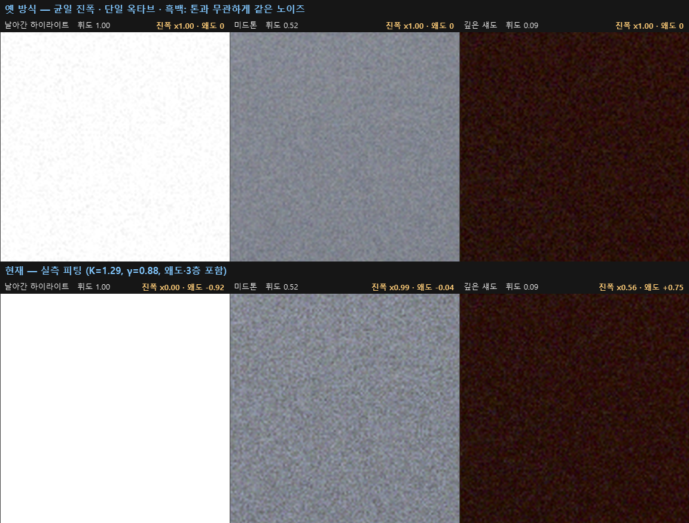
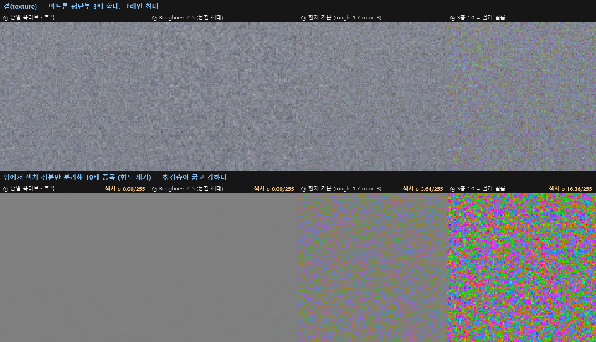

# 필름 그레인 — 에멀전 모델

Film Rawstery 의 그레인은 "노이즈를 얹는" 기능이 아니라, **실제 필름 에멀전이 보이는 통계적
성질을 따라가도록** 만든 모델이다. 네 가지를 모델링하며, **밑줄 친 것은 실제 필름 스캔에
피팅한 값**이다.

1. **노출 의존 진폭** — 미드톤에서 가장 잘 보이고 날아간 하이라이트/뭉개진 섀도에서는 사라진다
2. **왜도** — 섀도에서는 밝은 점, 하이라이트에서는 어두운 점 (분포가 톤에 따라 비대칭)
3. **멀티 옥타브** — 결정 크기 분포와 뭉침(clumping) 때문에 넓어진 스펙트럼
4. **3층 에멀전** — 컬러 필름의 R/G/B 발색층이 각자 독립 현상되며 생기는 색 얼룩

> ⚠️ **물리 시뮬레이션은 아니다.** 위 세 가지는 실제 필름의 성질이 맞지만, 이 구현은 그 성질을
> *재현*할 뿐 은염 결정의 현상 과정을 풀지 않는다. 자세한 범위는 [물리적 정직성](#물리적-정직성)
> 절에 정리했다.

관련 파일: `shaders/adjust.frag`(12단계) · `pipeline.py`(`_grain_field`) · `coeffs.py` ·
`ui/Main.qml`(GRAIN 섹션)

---

## 무엇이 달라지는가

<p align="center">
  
</p>

가운데가 **이 작업 전의 그레인**이다 — 균일 진폭 · 단일 옥타브 · 흑백 · 왜도 없음 · GRAIN 0.12.
오른쪽이 현재 모델. 둘 다 Grain 슬라이더 최대이고, 같은 크롭에서 **σ 6.6 → 10.9/255** 로
현재 쪽이 훨씬 진하다. 평탄한 벽면과 어두운 그릴을 비교하면 차이가 뚜렷하다.

⚠️ 이 문서의 "옛 방식" 패널은 전부 **당시 설정 그대로**다(왜도 끄고 GRAIN 도 0.12). 새 계수만
되돌린 반쪽 비교가 아니다.

⚠️ overview 만 **인물이 없는 다른 컷**(131_FUJI/DSCF1788)을 쓴다 — 공개 문서라서다. 나머지
그림은 날아간 하늘이 필요해 DSCF8035 를 그대로 쓴다.

---

## 1. 노출 의존 진폭

### 근거

눈에 보이는 톤 요동은 **입자 밀도 요동 × 특성곡선(D-logE)의 기울기**다. 기울기는 직선부
(미드톤)에서 최대고 toe(섀도)/shoulder(하이라이트)에서 0으로 떨어진다. 그래서 실제 필름은
새하얀 영역과 새까만 영역에 그레인이 보이지 않는다. 균일 진폭이 "디지털 노이즈"처럼 읽히는
가장 큰 이유가 이것이다.

### 구현

```glsl
float lg = pow(clamp(dot(rgb, LUMA), 0.0, 1.0), grainToneGammaK);   // γ<1 = 섀도 쪽으로
float w  = max(0.0, mix(1.0, sqrt(4.0*lg*(1.0-lg)), grainToneK));
rgb += n * grainAmt * grainK * w;
```

`sqrt` 를 씌워 반원형(가운데 평평, 끝단 급락)으로 만든 것은 특성곡선의 실제 형태에 맞춘 것이다.
`mix()` 의 기준점이 1.0 이라 **미드톤 진폭은 계수와 무관하게 항상 1.0** — 룩이 보존되고
재정규화가 필요 없다. ⚠️ K>1 이면 끝단에서 음수가 되므로 `max(0,·)` 가 필수다(음수면 노이즈가
반전된다). K=1.29 에서는 표시 휘도 1% 안팎에서만 걸린다.

### 실측 캘리브레이션

`GRAIN_TONE`(=K)은 눈대중이 아니라 **실제 필름 스캔에서 피팅**했다. Noritsu 미니랩 스캔
**4롤 · 151프레임**에서 클리핑·여백·구조를 배제한 **평탄 패치 11,512개**를 뽑아 σ vs 휘도를
재고, 위 식을 최소자승으로 맞췄다.

| 롤 | 프레임 | peak σ | 피팅 K |
|---|---|---|---|
| 00001113 | 37 | 10.41 | 1.37 |
| 00001114 | 37 | 9.75 | 1.32 |
| 20240427 | 38 | 9.65 | 1.19 |
| 20241006 | 36 | 10.20 | 1.23 |

절대 세기가 ±4% 로 모여 있어(같거나 비슷한 스톡) 평균해도 무방하고, **K 는 1.19~1.37**
(평균 **1.28**, 편차 5.5%) 로 롤 간에 잘 일치한다. 공통 K=1.28 로 통일해도 롤별 최적 대비
손해가 거의 없고, 이전 눈대중 값 0.70 대비 **잔차가 5~16배 개선**된다.

| 휘도 | 스캔 측정 | K=1.28 | 옛 K=0.70 |
|---|---|---|---|
| 32 | 0.54 | **0.57** | 0.76 |
| 108 | 0.95 | **0.99** | 0.99 |
| 158 | 0.92 | **0.96** | 0.98 |
| 208 | 0.68 | **0.71** | 0.84 |
| 229 | 0.46 | **0.50** | 0.72 |

#### 비대칭 γ — 한 번 기각했다가 되살렸다

처음에는 **대칭 벨(γ=1)만 채택**했다. 앙상블에서는 γ=0.84 가 더 맞았지만 롤별로 0.64~0.98 로
흔들려서, 필름의 성질이 아니라 롤별 노출/스캔 차이를 흡수하는 것으로 판단했다.

**그 판단은 틀렸다.** 원인은 피팅 데이터에 있었다 — 필름 여백/보더를 피하려 **휘도 18 미만을
통째로 제외**했는데, **γ 를 결정하는 게 바로 그 섀도 구간**이었다. 그래서 γ 가 제약 없이 떠다녔다.

클리핑된 픽셀이 섞인 패치만 배제하고 하한을 5 까지 내려 다시 재니 결과가 뒤집혔다:

| 모델 | 잔차 | 롤별 안정성 |
|---|---|---|
| 대칭 (K만) | 0.0532 | K 1.17 ±0.13 |
| 바닥값 wmin 추가 | 0.0532 | 측정 구간에서 한 번도 발동 안 함 = 무효 |
| **비대칭 γ** | **0.0270** | **K 1.32 ±0.04 · γ 0.87 ±0.13** |

γ 를 넣으니 K 가 **오히려 안정되고**(±0.07 → ±0.04) 잔차가 반감했으며, **네 롤이 모두 γ<1** 로
같은 방향을 가리킨다. 대칭 벨은 섀도(휘도 20~60)에서 10~15% 부족하고 상위 미드톤에서 7~12%
과했다 — 노이즈가 아니라 **체계적인 형태 불일치**였다.

채택: **K=1.29, γ=0.88**. 피크가 display 128 → 116 으로 옮겨가고, 그레인이 완전히 사라지는
구간이 휘도 3 이하 → 1 이하로 줄어든다.

| 휘도 | 실측 | 대칭(옛) | **비대칭(현재)** |
|---|---|---|---|
| 12 | 0.31 | 0.26 | 0.36 |
| 21 | 0.57 | 0.42 | **0.52** |
| 38 | 0.71 | 0.63 | **0.72** |
| 58 | 0.91 | 0.79 | **0.86** |
| 132 | 0.97 | 1.00 | 0.99 |
| 158 | 0.84 | 0.96 | **0.94** |
| 208 | 0.68 | 0.71 | **0.67** |

⚠️ 휘도 12 구간은 패치가 8개뿐이라 근거가 약하고, 그 아래는 여전히 측정된 바 없다.
20241006 롤은 피크가 휘도 58 에 있어 혼자 다르다(노출 부족 프레임이 많거나 다른 스톡).

### 세기 기준점

같은 스캔에서 **절대 세기**도 얻었다. 미드톤 σ 가 롤별 9.65~10.41/255 인데, 이전 `GRAIN=0.12`
에서 우리 슬라이더 최대치는 6.51 로 약 65% 였다. 스캐너 샤프닝이 스캔 σ 를 부풀렸을 것을 감안해
정확히 맞추는 0.184 대신 **9.22/255** 를 목표로 잡았다(당시 `GRAIN=0.17`. 이후 입자 크기를
실측에 맞추면서 샘플링이 바뀌어 같은 목표를 위해 **0.21** 로 재환산 — 아래 참조).
슬라이더 1.0 이 "실제 35mm 컬러 네거 수준"에 대응하므로 범위가 의미를 갖는다.

### 입자 크기도 실측에 맞췄다 (+ 서브픽셀 평균)

같은 출력 폭(3024px)에서 자기상관을 비교하니 **우리 그레인이 실제 필름보다 훨씬 굵었다**.
슬라이더를 최고로 곱게 해도(옛 gridN=1500) 실측의 2.7배였다 — 즉 **범위 전체가 굵은 쪽**에
있었다.

| | lag1 | lag2 |
|---|---|---|
| **실제 필름 스캔** | **0.234** | −0.084 |
| 옛 gridN=1500 (옛 기본) | 0.793 | 0.429 |
| 새 gridN=2900 (새 기본) | 0.522 | 0.150 |
| 새 gridN=4500 (새 최고 고움) | 0.343 | 0.062 |

그래서 범위를 `mix(1500, 500)` → **`mix(4500, 1300)`** 으로 옮겼다. 슬라이더 1.0(가장 굵음)이
대략 옛 기본과 비슷하므로 **옛 룩은 여전히 도달 가능**하고, 범위 전체가 필름 쪽으로 확장됐다.

셀이 픽셀보다 작아지면(새 기본은 프록시에서 0.88px) 점 샘플링이 접힌다. 실제 스캐너는 픽셀
면적을 **적분**하므로 **2×2 서브픽셀 평균**을 넣었다(`_GRAIN_SS` ↔ 셰이더 `GRAIN_SS` 루프).
⚠️ 오프셋에 쓰는 텍셀은 **그 인스턴스의 실제 렌더 크기**여야 한다 — 기존 `texelW` 는 샤프닝
공간스케일을 맞추려고 `pipeFull`(풀해상도)에서도 *프록시* 텍셀이라 쓰면 GPU export 의 오프셋이
2.4배 커진다. 전용 `grainTexelW/H` 를 따로 둔 이유다.

### 보간을 없앴다 — 곱기와 진하기를 맞바꾸지 않으려고

셀을 곱게 하면 서브픽셀 평균이 늘어 **세기가 같이 떨어졌다**(기본에서 9.22 → 7.32). 곱기(실측
acf)와 진하기(실측 σ)를 동시에 만족할 수 없었는데, 원인이 **보간 커널**이었다. 기존 value-noise 는
셀 사이를 smoothstep 으로 매끄럽게 이어 스펙트럼이 빨리 감쇠하고 서브픽셀 평균에서도 크게 깎인다.

보간을 아예 없애고 **셀마다 난수 하나**(경계가 딱 떨어짐)로 바꾸니 둘 다 풀렸다:

| 커널 (gridN 2900) | acf lag1 | σ 상대 |
|---|---|---|
| 선형 | 0.553 | 0.92 |
| smoothstep (기존) | 0.504 | 1.00 |
| ramp s=3 | 0.431 | 1.14 |
| **보간 없음** | **0.391** | **1.23** |
| *실측 필름* | *0.234* | |

보간을 걷어낼수록 **거칠어지면서 동시에 진해진다.** 실제 염료 구름도 경계가 뚜렷한 덩어리이니
물리적으로도 이쪽이 맞고, 모서리 4개 해시와 보간이 사라져 **더 빠르다**(26MP 22.7s → 16.8s).
굵은 설정에서 네모가 보일까 우려했으나 서브픽셀 평균 + 크기가 다른 3층 + 3옥타브가 격자를
깨줘서 확인 결과 문제없었다.

결과적으로 **grainSize=0 에서 실측 필름과 두 축이 모두 맞는다**:

| grainSize | acf lag1 | 슬라이더 최대 미드톤 σ |
|---|---|---|
| **0.00** | **0.242** ← 실측 0.234 | **9.21** ← 목표 9.22 |
| 0.50 (기본) | 0.388 | 11.04 |
| 1.00 (최고 굵음) | 0.722 | 13.36 |

즉 **슬라이더 최저 크기가 실측 35mm 컬러 네거**이고 굵을수록 그보다 진해진다. 슬라이더 최대가
실제 필름을 넘어서므로 사용자가 고를 여지가 생겼다(이전엔 최대가 필름에 못 미쳤다). 스캔이
샤프닝된 상태라 실측 lag1 0.234 는 하한이고, 보정 안 된 진짜 필름은 우리 기본(0.388) 쪽에
있을 수도 있다.

⚠️ **Size 는 Roughness/Color 와 달리 세기를 정규화하지 않았다**(범위 전체 1.45배 변동).
이유 둘: ① 방향이 Selwyn 법칙(고운 입자 = 낮은 granularity)과 같아 물리적으로 그럴듯하다.
② 완전 정규화하려면 σ비가 **cellPx 와 Roughness 의 2변수 함수**라(cellPx=0.4 에서 Roughness 에
따라 0.53~0.79) 그 피팅을 셰이더·numpy 양쪽에 박아야 해서 비용 대비 이득이 없다.

### 왜도 — 섀도의 흰 점, 하이라이트의 검은 점

"실제 필름은 흰색이 섞인 느낌인데 우리는 없다"는 관찰에서 출발해 **3차 모멘트(왜도)** 를 쟀다.
지금까지 2차(σ)와 그 톤 의존성은 맞췄지만 3차는 손댄 적이 없었고, `cellNoise − 0.5` 는 **정의상
완벽 대칭**이라 왜도가 정확히 0 이었다.

실측은 톤에 따라 **부호가 뒤집힌다**:

| 휘도대 | 18–45 | 45–80 | 80–120 | 120–160 | 160–200 | 200–238 |
|---|---|---|---|---|---|---|
| 왜도 | **+0.426** | +0.300 | +0.107 | −0.106 | −0.163 | **−0.393** |
| 1% trim 후 | +0.305 | +0.176 | +0.065 | −0.057 | −0.063 | −0.314 |

즉 **섀도에서는 밝은 점, 하이라이트에서는 어두운 점**이다. 상하위 1% 를 잘라내도 남으므로 먼지
같은 드문 오염이 아니라 분포 전체의 성질이고, **부호가 뒤집히는 것이 결정적 증거**다 — 먼지는
스캔에서 항상 밝은 점으로 나오므로 하이라이트의 −0.39 를 설명할 수 없다.

물리적으로는 진폭과 **같은 원인**(끝단 톤 압축: 검정 근처에선 아래로 갈 여지가 없고 흰색 근처에선
위로 갈 여지가 없다)에서 나온다. 우리는 진폭만 벨로 *부과*했기 때문에 왜도가 따라오지 않았다.

휘도에 대해 거의 선형이라 `skew(l) ≈ K·(1−2l)` 로 두고, 2차 왜곡으로 부과한다:

```glsl
float skewC = grainSkewK * (1.0 - 2.0*l0) * sqrt(12.0)/6.0;   // skew ≈ 6·c·σ, σ=1/√12
n = n + skewC * (n*n - v2);                                   // v2 = 채널별 해석적 분산
```

⚠️ **왜곡은 서브픽셀 평균 *전*, 샘플 단위에 걸어야 한다.** 그 지점의 채널별 분산은 해석적으로
알 수 있어서(셀 값이 정확히 균일분포 → 분산 1/12) 평균이 **정확히 0** 이 된다:

```
Var_i = [(1−k)² + k²aᵢ² + 2(1−k)k·aᵢ²/|a|] · nrm²/12
```

공칭 σ 를 대신 쓰면 실제 σ 와 어긋난 만큼 **그레인이 밝기를 옮긴다** — 처음에 그렇게 했다가
grainSize 1.0 에서 0.6/255 의 이동을 측정하고 바꿨다. 그레인이 노출을 바꾸면 안 된다.
해석적 분산으로 바꾼 뒤 이동은 0.01~0.08/255 로 사라졌다.

대신 서브픽셀 평균이 왜도를 희석한다(입자 크기에만 의존, 휘도와 무관: grainSize 0/0.5/1.0 에서
2.11 / 1.68 / 1.47 배). **기본 크기 기준으로 역보정**해 `GRAIN_SKEW = 0.55 × 1.68 = 0.92` 를 쓴다.
따라서 Size 를 움직이면 달성 왜도가 0.44~0.63 으로 변한다(목표 0.55) — 세기가 Size 에 따라
1.45배 변하는 것과 같은 성격이라 그대로 뒀다.

결과 (기본 크기):

| 휘도 | 31 | 62 | 100 | 219 |
|---|---|---|---|---|
| 실측 | +0.426 | +0.300 | +0.107 | −0.393 |
| **모델** | **+0.407** | **+0.281** | **+0.120** | **−0.384** |

26MP 그레인 필드 비용 16.6s → 19.2s.

### Roughness 도 실측으로 (+ 앞선 수치 정정)

입자 크기를 맞출 때 **Roughness 를 0.5 로 고정해두고** gridN 만 피팅했었다. 마지막 남은 휘도쪽
눈대중이라 둘을 동시에 다시 맞췄다.

⚠️ 이때 **스캐너 샤프닝을 함께 모델링해야 한다.** 스캔 acf 에는 음수 lag(−0.12)가 있는데 우리
모델은 음수를 만들 수 없어, 그대로 맞추면 "최대한 잘게"로 편향된다. 그래서 비교 대상을
`USM_a,σ(우리 필드(gridN, rough))` 로 두고 4 파라미터를 acf lag1..8 에 맞췄다.

**결과: Roughness ≈ 0.1** (기존 기본값 0.5). 그리고 이 결론은 샤프닝 추정에 의존하지 않는다:

| 가정한 샤프닝 a | 0.0 | 0.8 | 1.6 | 2.5 | 4.0 |
|---|---|---|---|---|---|
| 최적 Roughness | 0.1 | 0.0 | 0.0 | 0.0 | 0.1 |

| Roughness 고정 | 0.0 | **0.1** | 0.2 | 0.3 | **0.5(옛 기본)** | 1.0 |
|---|---|---|---|---|---|---|
| 잔차 | 0.00030 | **0.00027** | 0.00029 | 0.00066 | **0.00238** | 0.00617 |

즉 **실제 필름은 이 해상도에서 픽셀 너머 구조가 거의 없다.** 우리가 넣었던 f/2·f/4 옥타브는
필름에 없는 저주파를 더하고 있었다. 기본 크기(gridN 2900)에서 acf 잔차가 0.100 → 0.032 로 개선.

⚠️ **샤프닝 강도 자체는 믿을 수 없다** — a 가 탐색 범위 상단(4.0)까지 계속 올라간다. 우리
모델+USM 으로 실측 acf 형태를 정확히 재현하지 못해 피팅이 샤프닝으로 보상하는 것이다.
Roughness 결론만 (모든 a 에서 동일하므로) 유효하다.

⚠️ **격자가 다시 보이지 않는지 확인했다.** 멀티 옥타브를 넣은 이유 중 하나가 value-noise 의
격자 이방성 제거였기 때문. 보간을 없앤 뒤로는 1px 너머 상관이 사실상 0 이라 **이방성을 가질
구조 자체가 없고**, 눈으로도 Roughness 0.0/0.1/0.3/0.5 가 구분되지 않았다.
(이방성 비 지표는 이 조건에서 분모가 0 에 가까워 폭발하므로 더 이상 쓰지 말 것.)

#### 정정: 실측 lag1 은 0.234 가 아니라 ~0.15

위 문단들에서 비교 기준으로 쓴 **lag1 0.234 는 20241006 롤의 부분집합** 값이다. 4롤 전체를 모으면
**0.147** 이고, 롤별로는 0.142 / 0.143 / 0.185 / 0.224 로 20241006 이 가장 굵은 이상치다.

그래서 입자 크기는 **표면상 더 큰 격차**로 보이지만, 그 계산은 샤프닝을 무시한 것이었다. 샤프닝을
함께 모델링한 위 피팅은 **gridN 2200~3000** 을 내놓고 우리 기본값 2900 이 그 안에 든다 —
즉 크기 기본값은 그대로 두는 게 맞다. 샤프닝을 무시한 순진한 피팅이 gridN 3800~4500 으로
편향됐던 것이다.

### 기각된 시도: 이산 입자 모델

"격자 value-noise 대신 무작위 위치의 유한 크기 입자(Boolean/Poisson)를 뿌리면 실제 은염 결정의
all-or-nothing 현상을 재현한다" — 스파이크로 구현해 측정했고 **세 가지 이유로 기각**했다.

**① 해상도 영역이 맞지 않는다.** 픽셀당 염료 구름이 프록시 12~127개, export 2~21개다. 중심극한
정리가 강하게 적용되는 구간이고, 개별 입자를 분해하려면 프레임 폭이 36,000px 여야 한다.

**② 오히려 실측에서 멀어진다.** 첨도(가우시안=3.0, 패치 *내부* 기준): 실제 필름 **3.42** /
현재 value-noise **2.81** / 이산 입자 **2.16~2.70**. 샘플이 적으면 이산 모델은 두꺼운 꼬리가
아니라 **양자화**돼 분포가 오히려 납작해진다. (패치를 합쳐 재면 4.90 이 나오는데 σ 가 다른 패치를
섞어 생기는 착시다 — 반드시 패치 내부에서 재야 한다.)

**③ 비용.** 26MP·3층 기준 1샘플 27s / 4샘플 104s / 16샘플 362s. 게다가 1샘플은 필름이 아니라
픽셀 단위 소금후추 노이즈로 보인다.

### 기각된 시도: scene-linear 주입

"그레인을 `filmic()` **앞** scene-linear 에 노광 요동으로 주입하면 톤 의존이 파이프라인에서
저절로 나오고 `GRAIN_TONE` 계수가 사라진다" — 물리적으로 그럴듯해 보여 구현 전에 수치로
검증했고, **틀렸다.**

| 주입 모델 | 실측 대비 잔차 |
|---|---|
| 곱셈(노광 요동) `x·(1+εn)` | 1.087 |
| 가산(선형광 요동) `x+εn` | 3.213 |
| 곱셈 × 이항통계 | 0.753 |
| **현재(display 공간 벨)** | **0.010** |

원인은 진단에 그대로 나온다 — `filmic()` 의 **로그노광 기울기가 최대인 지점이 scene-linear
0.700(=knee), 즉 display 218** 인데 실측 그레인 피크는 **display ~125** 다. 곱셈 주입을 하면
그레인이 하이라이트에서 최대가 되어 필름과 정반대가 된다.

이유는 단순하다. **우리 `filmic()` 에는 toe 가 없다.** 이것은 sRGB OETF + 하이라이트 숄더이지
필름 특성곡선(D-logE)이 아니고, sRGB 의 로그노광 기울기는 knee 까지 단조 증가한다.
"톤커브 앞에 주입하면 톤 의존이 나온다"는 **톤커브가 필름 특성곡선일 때만** 성립한다.
toe 를 넣으려면 그레인이 아니라 전체 톤 파이프라인을 바꿔야 하므로(모든 사진의 룩이 바뀐다)
그레인 개선의 범위를 벗어난다.

부수적으로, 이 휘도는 **display 공간** 값이라 벨이 이미 섀도 쪽으로 치우쳐 있다
(disp 0.5 ≈ linear 0.21). 실제 필름에서 그레인이 하이라이트보다 섀도에 더 보이는 것과 맞아
떨어진다.

<p align="center">
  
</p>

세 영역이 각각 다른 이야기를 한다.

| | 진폭 | 왜도 | 읽는 법 |
|---|---|---|---|
| 날아간 하이라이트 | ×1.00 → **×0.00** | 0 → −0.92 | 하늘의 얼룩이 **사라진다** — 가장 극적 |
| 미드톤 | ×1.00 → ×0.99 | 0 → −0.04 | **일부러 안 건드린다**(룩 보존) |
| 깊은 섀도 | ×1.00 → **×0.56** | 0 → **+0.75** | 진폭은 줄고 **밝은 점**이 생긴다 |

⚠️ 섀도에서 "더 세짐"을 기대하면 안 된다. 실측이 그 반대다 — 필름은 깊은 섀도에서 진폭이
미드톤의 56% 로 떨어지고, 대신 분포가 밝은 쪽으로 크게 치우친다(+0.75). 옛 방식의 탁한 균일
노이즈 대신 **성긴 밝은 점**이 되는 것이 변화의 내용이고, 그게 스캔에서 측정된 모습이다.

⚠️ 영역마다 **다른 컷**을 쓴다 — 한 장으로 "날아간 하늘"과 "평탄한 깊은 섀도"를 동시에 얻을 수
없다. 하이라이트·미드톤은 DSCF8035, 섀도는 131_FUJI/DSCF1766(휘도 0.09 평탄부)이다.
전에는 섀도 패치가 휘도 0.22 라 진폭이 ×0.85 로 옛 방식과 거의 같았고 질감까지 있어
**무엇이 달라졌는지 읽히지 않았다.**

---

## 2. 멀티 옥타브 (fBm)

### 근거

단일 옥타브는 셀 크기가 하나뿐이라 규칙적으로 보인다. 실제 에멀전은 결정 크기 분포와
**결정 뭉침(clumping)** 때문에 Wiener 스펙트럼이 넓고 저주파 에너지가 크다.

### 구현

```glsl
// grainLayer() — 한 발색층의 옥타브 스택 (r = Roughness 슬라이더)
((valueNoise(g)                     - 0.5)
 + (valueNoise(g*0.5  + GRAIN_OFF1) - 0.5) * r
 + (valueNoise(g*0.25 + GRAIN_OFF2) - 0.5) * r*r)
* inversesqrt(1.0 + r*r + r*r*r*r)           // RMS 보존
```

**⚠️ 옥타브는 '거친 쪽'(f/2, f/4)으로만 쌓는다.** 기본 옥타브가 이미 프록시에서 셀 1.71px
(gridN=1500 @ 2560px)이라 f×2 는 Nyquist 미만이 된다. 그러면 프록시와 풀해상도에서 에일리어싱이
다르게 접혀 프리뷰 ≠ Export 가 된다. 거친 쪽으로 쌓는 것은 위의 clumping 근거와도 맞는다.

**⚠️ 옥타브 오프셋은 필수다.** 없으면 세 격자가 원점 정수 셀을 공유해 해시가 같은 값을 내고,
옥타브가 독립이 아니게 되어 아래의 RMS 정규화 전제가 깨진다.

### 시도했다가 되돌린 것: 옥타브 회전

value-noise 의 축정렬 격자 흔적을 없애려고 옥타브마다 좌표를 다른 각도로 회전시켜 봤다.
**측정 결과 기여가 없어서 제거했다.**

| | lag2 방향 이방성 | lag4 이방성 |
|---|---|---|
| 단일 옥타브 | 7.17 | ~10⁶ |
| 멀티옥타브, 회전 없음 | 2.58 | 1.56 |
| 멀티옥타브, 회전 있음 | 2.65 | 1.61 |

등방성 개선은 멀티옥타브 자체가 다 하고 있었다. 회전은 격자를 없애는 게 아니라 **돌려놓을
뿐**이었고, 공유 격자 주기(4셀=6.8px) 보강도 양쪽 다 ~0.01 로 무의미했다. 회전을 뺀 덕분에
좌표가 분리형으로 남아 [성능 최적화](#성능)가 가능해졌다 — 되돌리면 그 최적화가 깨진다.

---

## 3. 3층 에멀전

### 근거

컬러 필름에는 **휘도 입자가 따로 없다.** R/G/B 발색층 세 개가 각자 독립적으로 현상되고,
우리가 보는 휘도 요동은 그 셋의 **합**이다. 그래서 흑백 필드에 색 노이즈를 얹는 게 아니라,
층을 먼저 만들고 거기서 공통 성분을 뽑는 구조로 짰다.

### 층은 서로 다르다 — 크기도, 세기도

세 층에 같은 입자 크기와 같은 σ 를 주는 것은 틀렸다. 실제로는:

- **청감층(옐로 발색)이 가장 굵다.** 이유가 인과로 설명된다 — 고감도 에멀전을 얻는 주된 방법이
  **큰 은염 결정**을 쓰는 것이고, 그것이 **청감층에 필요**하며, 결과적으로 **큰 염료 구름**으로
  이어진다(Weaver & Long). 실제로 Kodak chromogenic 인화지에서 염료 구름은 1.25~4μm 이고
  **옐로가 시안·마젠타보다 크다**.
- **적감층(시안 발색)이 가장 곱다.** 층별 RMS granularity 는 Wratten W98/W99/W26 으로 각각
  측정하는데, 어느 리버설 필름 스펙에서 **적감층 RMS 가 녹감층의 20~90%** 로 규정된다.
- 게다가 **사람 눈은 옐로 방향 디테일을 가장 못 본다.** Kodak 이 1954년 층 순서를 바꿔 시안을
  위로 올린 이유 중 하나가 지각되는 mottling 을 줄이기 위해서였다. 즉 실제 컬러 필름은 색
  얼룩이 **눈이 둔감한 축에, 굵게** 몰려 있다.

그래서 층마다 상대 크기와 상대 진폭을 따로 준다:

| 층 | 발색 | 상대 입자 크기 | 상대 진폭 |
|---|---|---|---|
| 적감 | 시안 | 0.85 | 0.70 |
| 녹감 | 마젠타 | 1.00 | 1.00 |
| 청감 | **옐로** | **1.35** | **1.30** |

**염료 확산은 별도 블러로 만들지 않았다.** 확산의 물리적 결과가 "현상된 단위가 커지는 것"이므로
**유효 입자 크기 증가로 흡수**했다. 셰이더에 블러 패스가 늘지 않고, 물리적으로도 정직하다.

⚠️ 층별 크기가 다르면 격자가 달라지므로, 한 좌표에서 난수 3개를 뽑는 `hash23` 트릭은 쓸 수 없다.
스칼라 해시를 층마다 부른다(비용은 아래 [성능](#성능) 참조 — 거의 늘지 않았다).

### 구현

```glsl
float r = grainRough;
vec3 e = vec3(grainLayer(g0, r, GRAIN_LSIZE.r, GRAIN_LOFF0),    // 층마다 다른 격자
              grainLayer(g0, r, GRAIN_LSIZE.g, GRAIN_LOFF1),
              grainLayer(g0, r, GRAIN_LSIZE.b, GRAIN_LOFF2)) * GRAIN_LAMP;
float k    = grainColor;                          // Color 슬라이더
float mono = (e.r + e.g + e.b) / length(GRAIN_LAMP);   // 층 합 = 휘도 요동
vec3  n    = mix(vec3(mono), e, k) * nrm;
```

- `k=0` → 색 성분 제거, **휘도 요동만** 남음
- `k=1` → 세 층 완전 독립 = **컬러 필름의 물리**

⚠️ `k=0` 은 "흑백 필름 에멀전"이 아니라 "컬러 필름의 휘도 요동에서 색만 뺀 것"이다. 층 크기가
서로 달라 mono 도 세 스케일의 혼합이다(흑백 필름에도 결정 크기 분포가 있으니 결과 자체는
그럴듯하지만, 단층 에멀전을 모델링한 것은 아니다).

<p align="center">
  
</p>

아래 줄은 위 결과에서 휘도를 빼고 **색차 성분만 10배 증폭**한 것이다. ①②는 완전한 무채색
(흑백 그레인), ③부터 색 얼룩이 나타난다.

---

## 관통 원칙: 세기는 고정, 결만 변한다

세 단계 전부 **정규화를 걸어 그레인의 세기(σ)를 보존한다.** 파라미터를 돌려도 "얼마나 강한가"는
그대로고 "어떻게 생겼나"만 변한다. 슬라이더가 예측 가능하게 움직이는 이유다.

| 파라미터 | 보존되는 것 | 정규화 |
|---|---|---|
| `GRAIN_TONE`·`_GAMMA` | 미드톤 진폭 | `mix()` 기준점이 1.0 — 정규화 불필요 (K>1 이라 `max(0,·)` 필요) |
| `Roughness` (r) | 전체 σ | `1/√(1+r²+r⁴)` — 독립 노이즈 합의 RMS 는 `√Σaᵢ²` |
| `Color` (k) | **휘도** σ | `1/√((1−k)² + k²·Σ(Lᵢaᵢ)² + 2(1−k)k·Σ(Lᵢaᵢ²)/\|a\|)`  (aᵢ=층 진폭) |

Color 의 식에 교차항이 붙는 이유는 `mono` 가 층들의 합이라 층 자신과 상관이 있기 때문이다.
층 진폭이 모두 1 이면 `1/√((1−k)² + k²·|LUMA|² + 2(1−k)k/√3)` 로 환원된다(검증됨).
셰이더는 슬라이더가 실시간으로 변하므로 이 식을 인라인 계산하고(상수는 `LUMA` 와
`GRAIN_LAMP` 에서 유도해 리터럴 중복 없음), numpy 쪽은 `pipeline._grain_color_norm(k)` 를
쓴다. **수정 시 양쪽 동시.**

---

## 컨트롤 서페이스

<p align="center">
  
</p>

| | Lightroom (Effects 패널) | Film Rawstery |
|---|---|---|
| 세기 | Amount | Amount |
| 입자 크기 | Size | Size |
| 뭉침 | Roughness | Roughness *(실측 피팅 기본값 0.1)* |
| **발색층 독립도** | **없음** | **Color** — 흑백 단층 ↔ 컬러 3층 |

⚠️ **정직하게**: 위 표는 **노출된 컨트롤의 비교**다. 라이트룸이 Effects 패널에서 Amount / Size /
Roughness 세 개를 제공하고 컬러 그레인 축이 없다는 것은 확인된 사실이지만, **라이트룸 내부가
톤에 따라 무엇을 하는지는 우리가 알지 못한다.** 그러니 "라이트룸은 균일하게 뿌린다" 같은 주장은
하지 않는다. 이 문서의 어떤 이미지도 라이트룸 출력이 아니며, 전부 Film Rawstery 렌더다.

### 슬라이더로 노출되지 않지만 자동으로 일어나는 것

컨트롤 개수보다 중요한 건 **슬라이더를 건드리지 않아도 톤에 따라 알아서 달라진다**는 점이다.
아래 값은 전부 실제 필름 스캔에 피팅한 것이다.

| | 날아간 하이라이트 | 미드톤 | 섀도 |
|---|---|---|---|
| 진폭 | **×0.00** | ×0.99 | ×0.85 |
| 왜도 | **−0.92**(어두운 점) | −0.04 | **+0.51**(밝은 점) |

즉 하늘에는 그레인이 아예 없고, 섀도에는 남되 **밝은 점**으로 나타난다. 여기에 3층 에멀전이
겹쳐 청감층이 더 굵고 강하게 들어간다.

### 정규화 — 슬라이더가 서로 간섭하지 않는다

Roughness 와 Color 는 **세기를 바꾸지 않는다**(σ 고정, 결만 변함). 그래서 "거칠기를 올렸더니
그레인이 세졌다" 같은 일이 없고, 각 축을 독립적으로 판단할 수 있다. Size 만 예외로 1.45배
변하는데 이는 Selwyn 법칙 방향과 같아 의도적으로 남겨둔 것이다.

---

## 컨트롤

| 슬라이더 | 파라미터 | 기본 | 의미 |
|---|---|---|---|
| Grain | `grainAmt` | 0 | 세기 |
| Grain Size | `grainSize` | 0.5 | 입자 크기 (gridN = mix(4500, 1300) — 실측 기반, 아래 참조) |
| **Grain Roughness** | `grainRough` | **0.1**(실측) | 옥타브 감쇠비 — 균질 ↔ 뭉침 |
| **Grain Color** | `grainColor` | 0.3 | 층 독립도 — 흑백 단층 ↔ 컬러 3층 |

Roughness / Color 는 전역 계수가 아니라 **사진별 파라미터**다. 사이드카에 저장되고 undo/redo ·
복사·붙여넣기 · Export 에 모두 따라간다. 흑백 필름 시뮬을 쓰는 사진은 Color 0, 컬러 네거 느낌을
주고 싶은 사진은 0.5 — 이렇게 사진마다 다르게 갈 수 있다.

### Color 슬라이더를 어디에 둘 것인가

층별 차등이 들어오기 전에는 `k=1` 이 **색 얼룩 = 휘도의 2.11 배**로 고감도 디지털 노이즈처럼
보였다. 세 층에 같은 σ 와 같은 셀 크기를 줬기 때문이다. 층별 차등 이후로는 색 얼룩이
**청감층 쪽으로 몰리고 굵어진다**(B−Y 축이 R−G 축의 1.18 배, 청감층 자기상관 거리가 적감층의
약 2 배) — 실제 필름이 색 얼룩을 눈이 둔감한 축에 몰아두는 것과 같은 구조다.

다만 **색 얼룩의 총량 자체는 여전히 k 에 비례한다**(k=1 에서 R−G 는 휘도의 1.90 배, B−Y 는
2.24 배). 굵기와 축 분포가 달라졌을 뿐이므로, `k=1` 이 이제 자연스러운지는 눈으로 판단할
문제다. 기본값 **0.3 은 물리 유도값이 아니라 눈으로 고른 값**이고, 층별 상대 크기·진폭
수치도 순서만 물리에서 오고 크기는 인용 범위 안에서 고른 값이다.

---

## 프리뷰 = Export

Export(`pipeline._grain_field`)는 셰이더의 `hash12`/`valueNoise` 를 numpy 로 그대로 이식해
**동일한 연속 노이즈 필드**를 샘플한다. float32 스칼라 기준과 대조해 `max|Δ| = 0.0` 을 확인했다.
좌표가 uv 절대값 기반이라 스트립 경계 이음매도 없다(통째 렌더와 `array_equal`).

⚠️ **단 픽셀 단위 일치는 원리적으로 불가능하다.** 프리뷰는 프록시(2560px), Export 는 풀해상도
(6246px)로 **같은 연속 필드를 다른 밀도로 샘플**하기 때문이다. 해상도 상대 그레인의 본질적
한계이며, 구조와 성격은 일치한다.

같은 이유로 **그레인은 1:1 줌에서만 판단할 수 있다.** fit-to-screen 에서는 프록시가 화면 크기로
축소되며 그레인이 평균화돼 σ 가 1.5 배쯤 깎인다.

---

## 성능

3층 × 3옥타브는 26MP 에서 처음에 13.7 초가 걸렸다. 원인은 **셀 하나당 약 17 픽셀이 같은 해시를
재계산**하는 것이었고, 옥타브 회전을 걷어낸 덕에 좌표가 **분리형**(gx=열, gy=행)이라 두 단계로
줄일 수 있었다.

| | 26MP 필드 생성 |
|---|---|
| 순진한 픽셀별 평가 | 13.74s |
| 해시를 격자(ny×nx)에서 1회만 계산 | 9.49s |
| x 보간까지 격자 행에서 끝낸 뒤 픽셀로 확장 | **5.00s** |
| ↑ 이후 층별 개별 격자로 전환 | **4.93s** |
| ↑ 이후 2×2 서브픽셀 평균 도입 | **22.7s** |
| ↑ 이후 보간 제거(cellNoise) | **16.8s** |

두 최적화 모두 연산 순서를 바꾸지 않아 순진한 평가와 **비트 단위로 동일**함을 검증했다.

층별 개별 격자로 바뀌면서 `hash23`(한 좌표 → 난수 3개)을 못 쓰게 됐지만 **비용은 오히려 조금
줄었다.** 지배적 비용이 해시가 아니라 **풀해상도 배열의 gather·보간**인데, 그 횟수가 어느 쪽이든
9회(3옥타브 × 3채널 = 3층 × 3옥타브)로 같기 때문이다. 격자 자체(ny×nx ≈ 93K)는 픽셀 수(1.6M)에
비해 무시할 만하다.

---

## 검증

측정은 모두 `pipeline.render_full` 결과에서 그레인 없는 렌더를 뺀 차이의 표준편차다.
⚠️ 아래 표의 **절대 σ 값은 `GRAIN=0.12` 시절 측정치**다(세기 재조정 전). 비교의 요지는
비율이고 비율은 그대로 유효하다 — 현재 `GRAIN=0.17` 에서는 모든 값이 약 1.4배가 된다.

**노출 의존** (DSCF8035, 그레인 최대. 옛 K=0.70 대비 새 K=1.28)

| 톤 대역 | K=0.70 σ | K=1.28 σ | 비율 | 모델 예측 |
|---|---|---|---|---|
| deep shadow (0.02–0.15) | 5.34 | 3.98 | 0.75× | 0.63× |
| shadow (0.15–0.30) | 6.23 | 5.63 | 0.90× | 0.89× |
| **midtone (0.40–0.60)** | 6.92 | 6.89 | **1.00×** | 1.00× |
| highlight (0.70–0.85) | 6.46 | 5.99 | 0.93× | 0.89× |
| near white (0.85–0.97) | 4.71 | 3.03 | 0.64× | 0.65× |

미드톤 1.00× — 계수를 바꿔도 미드톤 룩은 그대로다(설계대로). 양 끝이 실측에 맞춰 더 깊게
빠졌다. deep shadow 가 예측(0.63)보다 덜 빠진 것은 그 대역에 이미지 구조가 섞여 있어서다.

**세기 보존 + 색축 분포** (DSCF8035, Roughness 0.5)

| Color | 휘도 σ | R−G σ | B−Y σ |
|---|---|---|---|
| 0.0 (색 제거) | 6.181 | 0.024 | 0.041 |
| 0.3 (기본) | 6.178 | 2.647 | 3.099 |
| 1.0 (컬러 필름) | 6.181 | 11.754 | 13.828 |

휘도 σ 가 6.18 로 고정 — 어떤 조합에서도 세기는 변하지 않는다. 그리고 **B−Y 축이 항상 R−G
축보다 크다**(비 1.18) = 색 얼룩이 청감층 쪽으로 몰린다.

**층별 차등이 실제로 걸렸는가** (단일 옥타브, 층 완전 독립, 채널별 가로 자기상관)

| 채널 | lag 1 | lag 2 | lag 3 |
|---|---|---|---|
| R (시안층) | 0.452 | 0.022 | −0.001 |
| G (마젠타층) | 0.568 | 0.080 | −0.001 |
| **B (옐로층)** | **0.736** | **0.275** | **0.038** |

상관 거리가 R < G < B — 청감층 입자가 실제로 가장 굵다. 채널 σ 도 k=1 에서 0.234 / 0.334 /
0.435 로 설계한 진폭비를 따른다.

**그 외** — `hash12` 가 float32 스칼라 기준과 `max|Δ|=0` · 층 진폭이 모두 1 이면 이전(층 동일)
정규화 식으로 **정확히 환원**(오차 0) · 스트립 결합 == 통째 렌더 · 구버전 사이드카(키 없음)
기본값 폴백 · 격자 최적화 == 순진한 평가(비트 단위).

---

## 물리적 정직성

이 모델은 **현상론적(phenomenological)** 이다. 실제 필름 그레인의 여러 통계적 성질을 재현하지만
물리 과정을 풀지는 않는다. 남은 비물리 항목:

1. **노이즈 원시체가 입자 모델이 아니다.** 실제 그레인은 무작위 위치에 흩어진 유한 크기 은염
   결정이 각각 현상되거나 안 되는 이산 확률 과정(푸아송/이항)이다. 여기서 쓰는 것은 **정규 격자**
   위의 value-noise 를 smoothstep 보간한 연속값이다. 격자 흔적이 방향 이방성으로 잔존한다
   (멀티옥타브로 7.2 → 2.6 완화했을 뿐 제거가 아니다).
2. **톤커브 뒤 display 공간에서 가산한다.** 실제 그레인은 톤커브 *앞* 의 밀도/노광 요동이므로,
   노출 의존 벨은 **이 위치 오류의 사후 보정**이지 유도된 물리가 아니다(다만 실제 필름 스캔에
   피팅돼 있어 결과는 측정에 맞는다). 참고로 이항분포의 σ=√(N·p(1−p)) 와 우리 벨 √(4l(1−l)) 은
   **같은 함수형**이다 — 우연히 맞는 형태를 골랐고, 변수만 display 휘도다.
   ⚠️ **"scene-linear 로 옮기면 톤 의존이 저절로 나온다"는 검증 결과 틀렸다 — 재시도 금지.**
   아래 [기각된 시도](#기각된-시도-scene-linear-주입) 참조.
3. **층별 상대값이 특정 필름에 피팅되지 않았다.** (층별 크기·진폭 차등 자체는 반영됨 — 순서는
   물리에서 왔지만 0.85/1.0/1.35 · 0.70/1.0/1.30 이라는 **수치는 인용 범위 안에서 고른 값**이다.
   실제 스톡에 맞추려면 고해상도 스캔에서 채널별로 피팅해야 한다.)
4. **Selwyn 법칙(σ ∝ 1/√면적)과 감도↔입자크기 결합이 없다.** Amount 와 Size 가 독립인 것은
   물리적이지 않다("고감도 = 큰 결정 = 굵은 그레인"이 실제).
5. **옥타브 가중이 실측 Wiener 스펙트럼 피팅이 아니다.** 눈대중으로 고른 fBm 이다.
6. 할레이션·층간 산란은 다루지 않는다(할레이션은 별도 기능 후보).

---

## 부록: 그림 재현

이 문서의 그림들은 클린 렌더 1회 후 그레인 단계만 바꿔 합성해 만들었다(매번 `render_full` 하면
rawpy 디코드가 미세하게 비결정적이라 패널 간 비교가 성립하지 않는다).

⚠️ **확대는 반드시 보간으로 한다.** 최근접 확대(`np.repeat`)로 뽑으면 **모든 픽셀이 하드
사각형**이 되어 그레인이 실제보다 각져 보인다 — 한동안 그렇게 뽑아 "입자가 각지다"는 오판을
불렀다. 참고로 자기상관의 각도 프로파일을 재보면 우리 필드는 **거의 등방적**이다(반경 2.5px 에서
0° 0.112 / 45° 0.105 / 90° 0.114). 크기가 다른 3층 × 3옥타브 × 서브픽셀 평균이 겹치며 정사각
격자가 통계적으로 씻겨나가기 때문이다. 다만 export 해상도에서는 셀이 2.15px 라 개별 셀이 블록으로
읽힐 수 있는데(프록시는 0.88px 라 안 보임), 경계를 완만하게 하면 실측으로 얻은 곱기·진하기가
후퇴하므로(램프 s=1.5 에서 σ −15%, lag1 0.217→0.294) 손대지 않았다. 생성 스크립트는 개인
사진 경로에 묶여 있어 저장소에 포함하지 않았다 — `pipeline._grain_field` 와 셰이더 12단계의
합성식만 그대로 따라 하면 재현된다.
